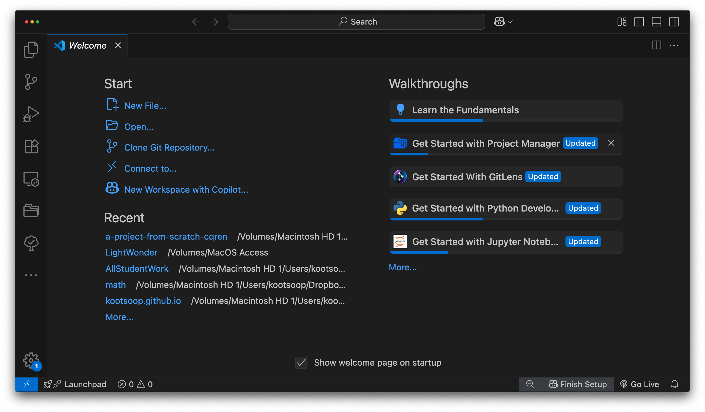
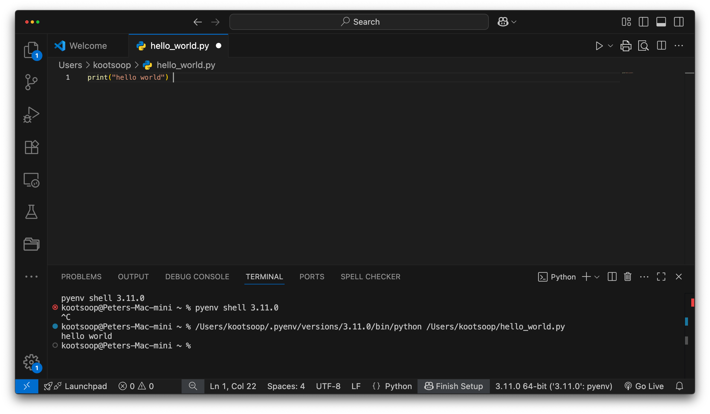
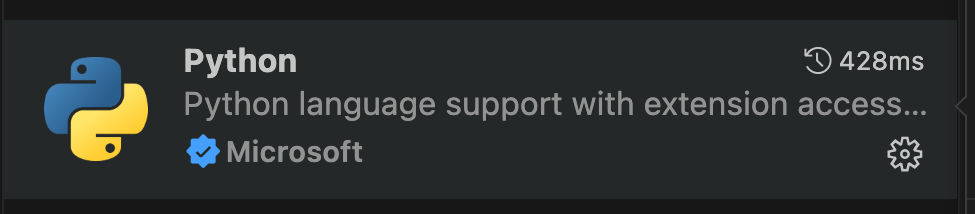

# First Steps

We will now see how to run a traditional 'Hello World' program in Python. This will teach you how to write, save and run Python programs.

There are two ways of using Python to run your program - using the interactive interpreter prompt or using a source file. We will now see how to use both of these methods.

## Using The Interpreter Prompt

Open the terminal in your operating system (as discussed previously in the [Installation](./installation.md#installation) chapter) and then open the Python prompt by typing `python3` and pressing `[enter]` key.

Once you have started Python, you should see `>>>` where you can start typing stuff. This is called the _Python interpreter prompt_.

At the Python interpreter prompt, type:

```python
print("Hello World")
```

followed by the `[enter]` key. You should see the words `Hello World` printed to the screen.

Here is an example of what you should be seeing, when using a Mac OS X computer. The details about the Python software will differ based on your computer, but the part from the prompt (i.e. from `>>>` onwards) should be the same regardless of the operating system.

<!-- The output should match pythonVersion variable in book.json -->
```python
$ python3
Python 3.6.0 (default, Jan 12 2017, 11:26:36)
[GCC 4.2.1 Compatible Apple LLVM 8.0.0 (clang-800.0.38)] on darwin
Type "help", "copyright", "credits" or "license" for more information.
>>> print("Hello World")
Hello World
```

Notice that Python gives you the output of the line immediately! What you just entered is a single Python _statement_. We use `print` to (unsurprisingly) print any value that you supply to it. Here, we are supplying the text `Hello World` and this is promptly printed to the screen.

### How to Quit the Interpreter Prompt

If you are using a GNU/Linux or OS X shell, you can exit the interpreter prompt by pressing `[ctrl + d]` or entering `exit()` (note: remember to include the parentheses, `()`) followed by the `[enter]` key.

If you are using the Windows command prompt, press `[ctrl + z]` followed by the `[enter]` key.

## Choosing An Editor

We cannot type out our program at the interpreter prompt every time we want to run something, so we have to save them in files and can run our programs any number of times.

To create our Python source files, we need an editor software where you can type and save. A good programmer's editor will make your life easier in writing the source files. Hence, the choice of an editor is crucial indeed. You have to choose an editor as you would choose a car you would buy. A good editor will help you write Python programs easily, making your journey more comfortable and helps you reach your destination (achieve your goal) in a much faster and safer way.

One of the very basic requirements is _syntax highlighting_ where all the different parts of your Python program are colorized so that you can _see_ your program and visualize its running.

For **CSC1203** we will use [Visual Studio Code.](https://code.visualstudio.com/download) This is available for Windows, MacOS, and Linux.



Once that's installed, create a new text file called `hello_world.py` and copy and past the following code into it.

```python
print("hello world")
```
Now click on the play button (arrow) in the top right.



the output is in the terminal partof the VS Code window at the bottom.

NOTE: You may have to install python language support from Microsoft to make this work:



Phew! That was quite a few steps to get started, but henceforth, every time we ask you to create a new file, remember to just right-click on `helloworld` on the left -> `New` -> `Python File` and continue the same steps to type and run as shown above.

## Using A Source File

Now let's get back to programming. There is a tradition that whenever you learn a new programming language, the first program that you write and run is the 'Hello World' program - all it does is just say 'Hello World' when you run it. As Simon Cozens[^1] says, it is the "traditional incantation to the programming gods to help you learn the language better."

Start your choice of editor, enter the following program and save it as `hello.py`.

For other editors, open a new file `hello.py` and type this:

```python
print("hello world")
```

Where should you save the file? To any folder for which you know the location of the folder. If you
don't understand what that means, create a new folder and use that location to save and run all
your Python programs:

- `/tmp/py` on Mac OS X
- `/tmp/py` on GNU/Linux
- `C:\py` on Windows

To create the above folder (for the operating system you are using), use the `mkdir` command in the terminal, for example, `mkdir /tmp/py`.

IMPORTANT: Always ensure that you give it the file extension of `.py`, for example, `foo.py`.

To run your Python program:

1. Open a terminal window (see the previous [Installation](./installation.md#installation) chapter on how to do that)
2. **C**hange **d**irectory to where you saved the file, for example, `cd /tmp/py`
3. Run the program by entering the command `python hello.py`. The output is as shown below.

```
$ python hello.py
hello world
```


If you got the output as shown above, congratulations! - you have successfully run your first Python program. You have successfully crossed the hardest part of learning programming, which is, getting started with your first program!

In case you got an error, please type the above program _exactly_ as shown above and run the program again. Note that Python is case-sensitive i.e. `print` is not the same as `Print` - note the lowercase `p` in the former and the uppercase `P` in the latter. Also, ensure there are no spaces or tabs before the first character in each line - we will see [why this is important](./basics.md#indentation) later.

**How It Works**

A Python program is composed of _statements_. In our first program, we have only one statement. In this statement, we call the `print` _statement_ to which we supply the text "hello world".

## Getting Help

If you need quick information about any function or statement in Python, then you can use the built-in `help` functionality. This is very useful especially when using the interpreter prompt. For example, run `help('len')` - this displays the help for the `len` function which is used to count number of items.

TIP: Press `q` to exit the help.

Similarly, you can obtain information about almost anything in Python. Use `help()` to learn more about using `help` itself!

In case you need to get help for operators like `return`, then you need to put those inside quotes such as `help('return')` so that Python doesn't get confused on what we're trying to do.

## Summary

You should now be able to write, save and run Python programs at ease.

Now that you are a Python user, let's learn some more Python concepts.

---

[^1]: the author of the amazing 'Beginning Perl' book
